# Proposta de arquitetura — Jeve Trader multimercado

Status: proposed
Revision: 1
Date: 2026-10-09
Map: [Arquitetura multimercado e inteligência verificável](map.md)
Decision evidence: [recibo JEV](jev-receipt.json)
Refinement evidence: [recibo complementar JEV](jev-supplement.json)
Implementation status: nenhuma alteração de código nesta rodada

O Jeve Trader evolui para um copiloto de mercados com identidade, qualidade e capacidades próprias por instrumento. A proposta reaproveita o host Tauri/React, o motor Python e a persistência existentes; a maior mudança está no contrato entre fonte, análise, conta e interface. Os detalhes das alternativas e da recomendação vivem nos tickets, que permanecem abertos durante o charting.

O refinamento propõe preservar subprocessos de aquisição e workers já existentes, com buffers limitados, enquanto o core ganha namespaces por instrumento/conta e contratos tipados. Uma extração adicional de processo exige limite medido. A projeção visual inicial é um snapshot limitado do workspace selecionado com registry resumido; não presume múltiplos painéis simultâneos.

```mermaid
flowchart LR
    B3[Feed B3 licenciado] --> AD[Adaptadores supervisionados]
    CR[API pública cripto] --> AD
    LE[Excel / replay legado] --> AD
    AD --> EV[Eventos tipados e qualidade por instrumento]
    EV --> ST[Estado causal e livro sincronizado]
    ST --> FE[Features e hipóteses por família]
    FE --> SC[Scheduler de contexto JEV]
    SC --> JV[Choice / Noul versionados]
    FE --> RI[Risco e candidatos determinísticos]
    AC[Conta read-only ou manual declarada] --> RC[Reconciliação e ledger]
    RC --> RI
    JV --> VG[Validade e evidência]
    RI --> VG
    VG --> UI[Cockpit por mercado / instrumento / conta]
    EV --> JR[Registro autorizado e replay causal]
    JV --> JR
    RC --> JR
    JR --> LA[Pesquisa e avaliação temporal offline]
    LA --> GA[Gate independente por escopo]
    GA --> ES[Estimador aprovado quando houver]
    ES --> RI
```

O diagrama descreve componentes propostos, inclusive os que não existem. Nenhuma seta representa envio de ordem. O estimador aprovado continua ausente no serviço atual; o gate e sua integração requerem trabalho próprio.

## Contratos que precisam anteceder o frontend

**InstrumentSpec** identifica venue, segmento, produto e contrato; mantém moeda, ativo base/cotado, precisão, tick, step, multiplicador, calendário e vencimento quando aplicáveis. WIN por vencimento, série contínua, spot e eventual derivativo preservam suas diferenças. Um livro não agrega venues; não se soma dinheiro de moedas diferentes sem taxa/origem/instante de conversão. [Ticket do instrumento](issues/05-identidade-instrumento.md).

**EventEnvelope e SourceCapabilities** preservam payload/proveniência autorizados, IDs e semântica de sequência, relógio do mercado, recebimento local e tempo monotônico. Qualidade é independente para quote, trades, livro e conta. Snapshot/deltas formam estado somente com o procedimento do provedor, incluindo reset após gap. TCP/WebSocket conectado não prova continuidade. [Pesquisas de B3](issues/01-dados-b3.md) e [cripto](issues/02-dados-cripto.md).

Não unificar negócios individuais/agregados ou lado maker/agressor sem preservar a semântica original e aplicar regra local comprovada. A sequência Coinbase por produto/conexão e a fronteira inicial Binance `U=L+1` têm divergências documentais abertas; precisam de prova no piloto. A cobertura B3 depende do entitlement e pode sofrer collapsing. Capacidades e perdas precisam aparecer no contexto enviado ao JEV.

**EvaluationIdentity** vincula instrumento, fonte/epoch, range de eventos, versão de metadados/features/perguntas, política de risco/custos, revisão da conta e instante de origem. Troca de workspace, reconexão com perda, mudança de versão ou conta invalida resultado pendente. Cache do JEV não renova idade. O frontend consome projeções limitadas; ingestão e diário não perdem eventos para reduzir carga visual. [Ticket de processamento](issues/04-fronteira-processamento.md).

**AccountSnapshot e execução informada** distinguem observação privada read-only, importação e entrada manual. Saldo, posições, ordens abertas e fills precisam escopo de conta, timestamps, revisões e idempotência. Reconciliação pode falhar; o painel explica o modo e bloqueia propostas dependentes de conta desatualizada. Configurar market data não cria acesso à conta. [Ticket de automação](issues/08-automacao-conta.md).

## Inteligência do negócio e JEV

O JEV interpreta hipóteses explícitas apoiadas no estado causal. Regras de elegibilidade, quantização, moeda, margem, custos e risco permanecem locais. Choice econômico continua condicionado a candidatos admissíveis e a estimativa aprovada para o instrumento, venue, horizonte e custos respectivos. Sempre considerar aguardar/q=0; sem essa estimativa o contexto pode ser mostrado, mas a recomendação financeira mantém sua limitação atual.

O scheduler proposto dispara por mudança relevante, respeita orçamento e um limite de pendências, agrega pedidos substituídos e descarta respostas obsoletas. Seu cache exige identidade exata e prazo original. As perguntas distinguem apoio, contradição, insuficiência e alternativas. Timeout e abstenção produzem estado visível, sem repetir chamadas até obter a resposta desejada. Os limites de consultas do plugin de desenvolvimento não alteram automaticamente o orçamento do aplicativo.

A política recomendada no refinamento prioriza relevância/severidade de eventos elegíveis com aging para evitar starvation. Fairness, limite de espera, coalescência e carga precisam de critérios prospectivos. Gap ou conta inválida bloqueiam localmente; a urgência não dispensa elegibilidade para chamar o JEV.

Aprendizagem significa inicialmente registro causal, revisão de casos e pesquisa offline versionada. Comparar regra determinística, quantitativo e quantitativo+JEV em partições temporais com teste futuro separado, custos, slippage, cobertura, abstenção e incerteza. Promoção tem gate independente; pesos e regras não se alteram automaticamente na conta real. Benefício de compreensão, desempenho do software e retorno econômico têm métricas separadas. [Ticket de inteligência](issues/06-inteligencia-jev.md).

## Jornada de frontend proposta

1. **Conectar mercado:** escolher fonte e instrumento compatíveis. Metadata pode ser descoberta; permissões, contrato e estado de conexão são verificados. Dados públicos dispensam preenchimento de chave quando a documentação permitir.
2. **Ver a decisão:** workspace mostra instrumento/venue, decisão vigente ou aguardar, evidência essencial, saúde dos dados e conta. Um clique abre alternativas, fundamentos e histórico; diagnósticos técnicos ficam em detalhes.
3. **Acompanhar sem preenchimento repetido:** conectar/reconectar e revisar importações substitui redigitar metadados e execuções quando houver integração válida. O modo manual permanece identificado onde a API faltar.
4. **Investigar uma falha:** desconexão, gap, atraso, livro não sincronizado e conta não reconciliada têm causas e ações distintas. Reconnect não retira o bloqueio até o estado reconstruir sua validade.
5. **Revisar resultados:** histórico preserva avaliação e fonte originais. Trocar para outra conta/venue não reaproveita capital ou estimativa do workspace anterior.

Mapa de informação, sujeito ao protótipo e à avaliação de compreensão:

| Área | Conteúdo principal | Detalhe sob demanda |
|---|---|---|
| Cabeçalho do workspace | Mercado, venue, instrumento, conta/modo e conexão | Capacidades e contrato da fonte |
| Centro de decisão | Decisão vigente, hipóteses, impedimentos, alternativa aguardar | Versões, evidências e resposta JEV |
| Mercado | Preço, trades/livro quando válidos, regime observado | Gaps, latência da fonte e recovery |
| Conta e risco | Estado conciliado/manual, exposição e custos conhecidos | Ledger, revisões e divergências |
| Revisão | Casos, decisões históricas e resultados vinculados | Experimentos e gates por escopo |

Preservar acessibilidade, movimento reduzido e fallback já existentes. 3D permanece opcional conforme dados/recursos; não é a navegação principal proposta. Virtualização e coalescência limitam o trabalho visual sem alterar o registro de mercado. Antes de implementar, estabelecer workload, p95, memória e condições nativas; não usar a quantidade de animações como métrica de melhoria. [Ticket do frontend](issues/07-jornada-frontend.md).

## Sequência candidata e dependências

| Entrega futura | Resultado verificável | Gate |
|---|---|---|
| Contratos comuns | Instrumento/capacidades/identidade/eventos sem pressupostos WIN globais; compatibilidade com dados existentes | Tickets de arquitetura e contrato fechados, schemas/aceites revisados |
| Piloto público cripto spot | Stream real, replay causal e recuperação; snapshot/deltas se L2 estiver no recorte, sem conta/ordens | Dados mínimos/venue/endpoint/símbolo e regionalidade qualificados; SPEC finita ready |
| Feed B3 independente | WIN autorizado com trades/livro no nível contratado, recovery e medição real | Licença BM&F, contrato de uso e acesso documentados; custos dependem do usuário |
| Conta read-only | Importação idempotente/reconciliação de saldo/posição/fills, falhas visíveis | API/escopos/documentação e autorização de credenciais correspondentes |
| Scheduler e cockpit | Cadência tipada, invalidação, jornadas menores e performance prospectiva | Dados e contas no escopo; protótipo/revisão e budget anterior ao código |
| Pesquisa de inteligência | Casos/labels causais, avaliação de compreensão e financeira separadas | Corpus autorizado, baseline, critérios temporais e revisão independente |

Qualificar B3 pode ocorrer em paralelo ao piloto público. A escolha de fornecedor e a inclusão de derivativos cripto ainda não estão decididas. [Ticket da sequência](issues/09-sequencia-pilotos.md) e [prontidão dos contratos](issues/11-prontidao-contratos.md).

O JEV se absteve sobre o recorte do piloto cripto no lote complementar. Nenhum venue foi escolhido. A próxima evidência deve ligar uma hipótese de negócio aos dados mínimos (trades, L1, L2), ao workload e ao contrato/regionalidade antes de repetir essa decisão.
